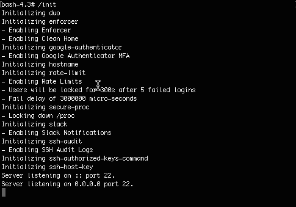
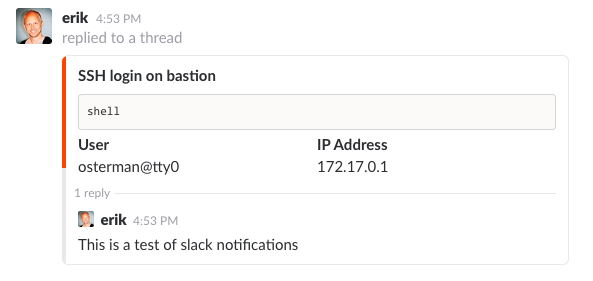

<!-- markdownlint-disable -->
<a href="https://cpco.io/homepage"></a><br/>
    <p align="right">
<a href="https://github.com/cloudposse/bastion/releases/latest"></a><a href="https://github.com/cloudposse/bastion/actions/workflows/integration-tests.yml"></a><a href="https://slack.cloudposse.com"></a></p>
<!-- markdownlint-restore -->

<!--


  ** DO NOT EDIT THIS FILE
  **
  ** This file was automatically generated by the `cloudposse/build-harness`.
  ** 1) Make all changes to `README.yaml`
  ** 2) Run `make init` (you only need to do this once)
  ** 3) Run`make readme` to rebuild this file.
  **
  ** (We maintain HUNDREDS of open source projects. This is how we maintain our sanity.)
  **


-->

This is a secure/locked-down bastion implemented as a Docker Container. It uses Alpine Linux as the base image and ships with support for Google Authenticator & DUO MFA support.

It was designed to be used on Kubernetes together with [GitHub Authorized Keys](https://github.com/cloudposse/github-authorized-keys) to provide secure remote access to production clusters.
### MFA Setup & Usage

Here's a demo of what a user experiences when setting up Google Authenticator for the first time.



When using Duo as the MFA provider, this becomes even more magical because Duo supports automatic Push notifications to your mobile device.
Just approve the request on your mobile phone (e.g. with a thumb press on iOS) when prompted.

### Slack Notifications

Here's what it looks like when someone connects to the bastion if Slack notifications are enabled.



We recommend using Slack notifications for self-reporting.
* Any time a user accesses production systems, they should reply to the slack notification to justify their remote access.
* A "buddy" should approve the login by adding a reaction (e.g. ✅).
* If no one approves the login, it should trigger an *incident response* to track down the unauthorized access.


## Usage

### Running

Refer to the [Environment Variables](#environment-variables) section below to tune how the `bastion` operates.


```bash
$ docker run -p 1234:22 cloudposse/bastion:latest
```

### Building

```bash
$ git clone https://github.com/cloudposse/bastion.git
$ cd bastion
$ make docker:build
```

### Testing

Run basic connection tests

```bash
$ make test
```

### Configuration

## Recommendations

* Do not allow `root` (or `sudo`) access to this container as doing so would allow remote users to manipulate audit-logs in `/var/log/sudo-io`
* Use the bastion as a "jump host" for accessing other internal systems rather than installing a lot of unnecessary stuff, which increases the overall attack surface.
* Sync the contents of `/var/log/sudo-io` to a remote, offsite location. If using S3, we recommend enabling bucket-versioning.
* Use [`github-authorized-keys](https://github.com/cloudposse/github-authorized-keys/) to automatically provision users; or use the [Helm chart](https://github.com/cloudposse/charts/tree/master/incubator/bastion).
* Bind-mount `/etc/passwd`, `/etc/shadow` and `/etc/group` into the container as *read-only*
* Bind-mount `/home` into container; the bastion does not manage authorized keys

#### Environment Variables

The following tables lists the most relevant environment variables of the `bastion` image and their default values.

##### Duo Settings

Duo is a enterprise MFA provider that is very affordable. Details here: https://duo.com/pricing


| ENV               |      Description                                    |  Default |
|-------------------|:----------------------------------------------------|:--------:|
| `MFA_PROVIDER`    |  Enable the Duo MFA provider                        | duo      |
| `DUO_IKEY`        |  Duo Integration Key                                |          |
| `DUO_SKEY`        |  Duo Secret Key                                     |          |
| `DUO_HOST`        |  Duo Host Endpoint                                  |          |
| `DUO_FAILMODE`    |  How to fail if Duo cannot be reached               | secure   |
| `DUO_AUTOPUSH`    |  Automatically send a push notification             | yes      |
| `DUO_PROMPTS`     |  How many times to prompt for MFA                   | 1        |


##### Google Authenticator Settings

Google Authenticator is a free & open source MFA solution. It's less secure than Duo because tokens are stored on the server under each user account.


| ENV               |      Description                                    |  Default              |
|-------------------|:----------------------------------------------------|:---------------------:|
| `MFA_PROVIDER`    |  Enable the Google Authenticator provider           | google-authenticator  |


##### Enforcer Settings

The enforcer ensures certain conditions are satisfied. Currently, these options are supported.

| ENV                           |  Description                                                 |  Default |
|-------------------------------|:-------------------------------------------------------------|:--------:|
| `ENFORCER_ENABLED`            |  Enable general enforcement                                  | `true`   |
| `ENFORCER_CLEAN_HOME_ENABLED` |  Erase dot files in home directory before starting session   | `true`   |

##### Slack Notifications

The enforcer is able to send notifications to a slack channel anytime there is an SSH login.

| ENV                        |      Description                                    |  Default  |
|----------------------------|:----------------------------------------------------|:---------:|
| `SLACK_ENABLED`            | Enabled Slack integration                           | `false`   |
| `SLACK_HOOK`               | Slack integration method (e.g. `pam`, `sshrc`)      | `sshrc`   |
| `SLACK_WEBHOOK_URL`        | Webhook URL                                         |           |
| `SLACK_USERNAME`           | Slack handle of bot (defaults to short-dns name)    |           |
| `SLACK_TIMEOUT`            | Request timeout                                     | `2`       |
| `SLACK_FATAL_ERRORS`       | Deny logins if slack notification fails             | `true`    |


##### SSH Auditor

The SSH auditor uses [`sudosh`](https://github.com/cloudposse/sudosh/) to record entire SSH sessions (`stdin`, `stdout`, and `stderr`).


| ENV                   |      Description                                    |  Default     |
|-----------------------|:----------------------------------------------------|:------------:|
| `SSH_AUDIT_ENABLED`   |  Enable the SSH Audit facility                      | `true`       |

This will require that users login with the `/usr/bin/sudosh` shell.

Update user's default shell by running the command: `usermod -s /usr/bin/sudosh $username`. By default, `root` will automatically be updated to use `sudosh`.

Use the `sudoreplay` command to audit/replay sessions.


#### User Accounts & SSH Keys

The `bastion` does not attempt to manage user accounts. We suggest using [GitHub Authorized Keys](https://github.com/cloudposse/github-authorized-keys) to provision user accounts and SSH keys. We provide a [chart](https://github.com/cloudposse/charts/tree/master/incubator/bastion) of how we recommend doing it.

### Extending

The `bastion` was written to be easily extensible.

You can extend the enforcement policies by adding shell scripts to `etc/enforce.d`. Any scripts that are `+x` (e.g. `chmod 755`) will be executed at runtime.

## Thanks

- [@neochrome](https://github.com/neochrome/docker-bastion), for providing a great basic bastion built on top of Alpine Linux
- [@aws](https://aws.amazon.com/blogs/security/how-to-record-ssh-sessions-established-through-a-bastion-host/), for providing detailed instructions on how to do SSH session logging.
- [@duo](https://duo.com/docs/duounix), for providing excellent documentation
- [@google](https://github.com/google/google-authenticator-libpam) for contributing Google Authenticator to the Open Source community


## Quick Start


Here's how you can quickly demo the `bastion`. We assume you have `~/.ssh/authorized_keys` properly configured and your SSH key (e.g. `~/.ssh/id_rsa`) added to your SSH agent.


```bash
$ docker run -it -p 1234:22 \
     -e MFA_PROVIDER=google-authenticator \
     -v ~/.ssh/authorized_keys:/root/.ssh/authorized_keys \
     cloudposse/bastion
```

Now, in another terminal you should be able to run:
```bash
$ ssh root@localhost -p 1234
```

The first time you connect, you'll be asked to setup your MFA device. Subsequently, each time you connect, you'll be prompted to enter your MFA token.


## ✨ Contributing

This project is under active development, and we encourage contributions from our community.


Many thanks to our outstanding contributors:

<a href="https://github.com/cloudposse/bastion/graphs/contributors">
  
</a>

For 🐛 bug reports & feature requests, please use the [issue tracker](https://github.com/cloudposse/bastion/issues).

In general, PRs are welcome. We follow the typical "fork-and-pull" Git workflow.
 1. Review our [Code of Conduct](https://github.com/cloudposse/bastion/?tab=coc-ov-file#code-of-conduct) and [Contributor Guidelines](https://github.com/cloudposse/.github/blob/main/CONTRIBUTING.md).
 2. **Fork** the repo on GitHub
 3. **Clone** the project to your own machine
 4. **Commit** changes to your own branch
 5. **Push** your work back up to your fork
 6. Submit a **Pull Request** so that we can review your changes

**NOTE:** Be sure to merge the latest changes from "upstream" before making a pull request!

### 🌎 Slack Community

Join our [Open Source Community](https://cpco.io/slack?utm_source=github&utm_medium=readme&utm_campaign=cloudposse/bastion&utm_content=slack) on Slack. It's **FREE** for everyone! Our "SweetOps" community is where you get to talk with others who share a similar vision for how to rollout and manage infrastructure. This is the best place to talk shop, ask questions, solicit feedback, and work together as a community to build totally *sweet* infrastructure.

### 📰 Newsletter

Sign up for [our newsletter](https://cpco.io/newsletter?utm_source=github&utm_medium=readme&utm_campaign=cloudposse/bastion&utm_content=newsletter) and join 3,000+ DevOps engineers, CTOs, and founders who get insider access to the latest DevOps trends, so you can always stay in the know.
Dropped straight into your Inbox every week — and usually a 5-minute read.

### 📆 Office Hours <a href="https://cloudposse.com/office-hours?utm_source=github&utm_medium=readme&utm_campaign=cloudposse/bastion&utm_content=office_hours"></a>

[Join us every Wednesday via Zoom](https://cloudposse.com/office-hours?utm_source=github&utm_medium=readme&utm_campaign=cloudposse/bastion&utm_content=office_hours) for your weekly dose of insider DevOps trends, AWS news and Terraform insights, all sourced from our SweetOps community, plus a _live Q&A_ that you can’t find anywhere else.
It's **FREE** for everyone!
## License

<a href="https://opensource.org/licenses/Apache-2.0"></a>

<details>
<summary>Preamble to the Apache License, Version 2.0</summary>
<br/>
<br/>

Complete license is available in the [`LICENSE`](LICENSE) file.

```text
Licensed to the Apache Software Foundation (ASF) under one
or more contributor license agreements.  See the NOTICE file
distributed with this work for additional information
regarding copyright ownership.  The ASF licenses this file
to you under the Apache License, Version 2.0 (the
"License"); you may not use this file except in compliance
with the License.  You may obtain a copy of the License at

  https://www.apache.org/licenses/LICENSE-2.0

Unless required by applicable law or agreed to in writing,
software distributed under the License is distributed on an
"AS IS" BASIS, WITHOUT WARRANTIES OR CONDITIONS OF ANY
KIND, either express or implied.  See the License for the
specific language governing permissions and limitations
under the License.
```
</details>

## Trademarks

All other trademarks referenced herein are the property of their respective owners.


---
Copyright © 2017-2025 [Cloud Posse, LLC](https://cpco.io/copyright)


<a href="https://cloudposse.com/readme/footer/link?utm_source=github&utm_medium=readme&utm_campaign=cloudposse/bastion&utm_content=readme_footer_link"></a>


