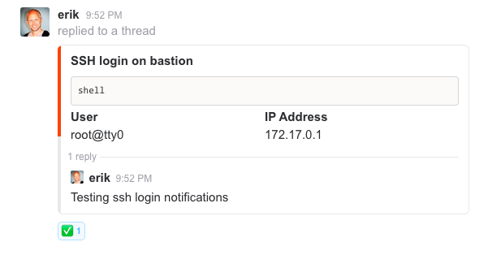

<!-- This file was automatically generated by the `build-harness`. Make all changes to `README.yaml` and run `make readme` to rebuild this file. -->
[![README Header][readme_header_img]][readme_header_link]

[![Cloud Posse][logo]](https://cpco.io/homepage)

# bastion [](https://travis-ci.org/cloudposse/bastion) [](https://github.com/cloudposse/bastion/releases/latest) [](https://slack.cloudposse.com)


This is a secure/locked-down bastion implemented as a Docker Container. It uses Alpine Linux as the base image and ships with support for Google Authenticator & DUO MFA support.

It was designed to be used on Kubernetes together with [GitHub Authorized Keys](https://github.com/cloudposse/github-authorized-keys) to provide secure remote access to production clusters.
### MFA Setup & Usage

Here's a demo of what a user experiences when setting up Google Authenticator for the first time.


When using Duo as the MFA provider, this becomes even more magical because Duo supports automatic Push notifications to your mobile device.
Just approve the request on your mobile phone (e.g. with a thumb press on iOS) when prompted.

### Slack Notifications

Here's what it looks like when someone connects to the bastion if Slack notifications are enabled.



We recommend using Slack notifications for self-reporting.
* Any time a user accesses production systems, they should reply to the slack notification to justify their remote access.
* A "buddy" should approve the login by adding a reaction (e.g. ✅).
* If no one approves the login, it should trigger an *incident response* to track down the unauthorized access.


---

This project is part of our comprehensive ["SweetOps"](https://cpco.io/sweetops) approach towards DevOps. 
[][share_email]
[][share_googleplus]
[][share_facebook]
[][share_reddit]
[][share_linkedin]
[][share_twitter]


It's 100% Open Source and licensed under the [APACHE2](LICENSE).


## Usage

### Running

Refer to the [Environment Variables](#environment-variables) section below to tune how the `bastion` operates.


```bash
$ docker run -p 1234:22 cloudposse/bastion:latest
```

### Building

```bash
$ git clone https://github.com/cloudposse/bastion.git
$ cd bastion
$ make docker:build
```


### Configuration

## Recommendations

* Do not allow `root` (or `sudo`) access to this container as doing so would allow remote users to manipulate audit-logs in `/var/log/sudo-io`
* Use the bastion as a "jump host" for accessing other internal systems rather than installing a lot of unnecessary stuff, which increases the overall attack surface.
* Sync the contents of `/var/log/sudo-io` to a remote, offsite location. If using S3, we recommend enabling bucket-versioning.
* Use [`github-authorized-keys](https://github.com/cloudposse/github-authorized-keys/) to automatically provision users; or use the [Helm chart](https://github.com/cloudposse/charts/tree/master/incubator/bastion).
* Bind-mount `/etc/passwd`, `/etc/shadow` and `/etc/group` into the container as *read-only*
* Bind-mount `/home` into container; the bastion does not manage authorized keys

#### Environment Variables

The following tables lists the most relevant environment variables of the `bastion` image and their default values.

##### Duo Settings

Duo is a enterprise MFA provider that is very affordable. Details here: https://duo.com/pricing


| ENV               |      Description                                    |  Default |
|-------------------|:----------------------------------------------------|:--------:|
| `MFA_PROVIDER`    |  Enable the Duo MFA provider                        | duo      |
| `DUO_IKEY`        |  Duo Integration Key                                |          |
| `DUO_SKEY`        |  Duo Secret Key                                     |          |
| `DUO_HOST`        |  Duo Host Endpoint                                  |          |
| `DUO_FAILMODE`    |  How to fail if Duo cannot be reached               | secure   |
| `DUO_AUTOPUSH`    |  Automatically send a push notification             | yes      |
| `DUO_PROMPTS`     |  How many times to prompt for MFA                   | 1        |


##### Google Authenticator Settings

Google Authenticator is a free & open source MFA solution. It's less secure than Duo because tokens are stored on the server under each user account.


| ENV               |      Description                                    |  Default              |
|-------------------|:----------------------------------------------------|:---------------------:|
| `MFA_PROVIDER`    |  Enable the Google Authenticator provider           | google-authenticator  |


##### Enforcer Settings

The enforcer ensures certain conditions are satisfied. Currently, these options are supported.

| ENV                           |  Description                                                 |  Default |
|-------------------------------|:-------------------------------------------------------------|:--------:|
| `ENFORCER_ENABLED`            |  Enable general enforcement                                  | `true`   |
| `ENFORCER_CLEAN_HOME_ENABLED` |  Erase dot files in home directory before starting session   | `true`   |

##### Slack Notifications

The enforcer is able to send notifications to a slack channel anytime there is an SSH login.

| ENV                        |      Description                                    |  Default  |
|----------------------------|:----------------------------------------------------|:---------:|
| `SLACK_ENABLED`            | Enabled Slack integration                           | `false`   |
| `SLACK_HOOK`               | Slack integration method (e.g. `pam`, `sshrc`)      | `sshrc`   |
| `SLACK_WEBHOOK_URL`        | Webhook URL                                         |           |
| `SLACK_USERNAME`           | Slack handle of bot (defaults to short-dns name)    |           |
| `SLACK_TIMEOUT`            | Request timeout                                     | `2`       |
| `SLACK_FATAL_ERRORS`       | Deny logins if slack notification fails             | `true`    |


##### SSH Auditor

The SSH auditor uses [`sudosh`](https://github.com/cloudposse/sudosh/) to record entire SSH sessions (`stdin`, `stdout`, and `stderr`).


| ENV                   |      Description                                    |  Default     |
|-----------------------|:----------------------------------------------------|:------------:|
| `SSH_AUDIT_ENABLED`   |  Enable the SSH Audit facility                      | `true`       |

This will require that users login with the `/usr/bin/sudosh` shell.

Update user's default shell by running the command: `usermod -s /usr/bin/sudosh $username`. By default, `root` will automatically be updated to use `sudosh`.

Use the `sudoreplay` command to audit/replay sessions.


#### User Accounts & SSH Keys

The `bastion` does not attempt to manage user accounts. We suggest using [GitHub Authorized Keys](https://github.com/cloudposse/github-authorized-keys) to provision user accounts and SSH keys. We provide a [chart](https://github.com/cloudposse/charts/incubator/bastion.git) of how we recommend doing it.

### Extending

The `bastion` was written to be easily extensible.

You can extend the enforcement policies by adding shell scripts to `etc/enforce.d`. Any scripts that are `+x` (e.g. `chmod 755`) will be executed at runtime.

## Thanks

- [@neochrome](https://github.com/neochrome/docker-bastion), for providing a great basic bastion built on top of Alpine Linux
- [@aws](https://aws.amazon.com/blogs/security/how-to-record-ssh-sessions-established-through-a-bastion-host/), for providing detailed instructions on how to do SSH session logging.
- [@duo](https://duo.com/docs/duounix), for providing excellent documentation
- [@google](https://github.com/google/google-authenticator-libpam) for contributing Google Authenticator to the Open Source community

## Quick Start


Here's how you can quickly demo the `bastion`. We assume you have `~/.ssh/authorized_keys` properly configured and your SSH key (e.g. `~/.ssh/id_rsa`) added to your SSH agent.


```bash
$ docker run -it -p 1234:22 \
     -e MFA_PROVIDER=google-authenticator \
     -v ~/.ssh/authorized_keys:/root/.ssh/authorized_keys
     cloudposse/bastion
```

Now, in another terminal you should be able to run:
```bash
$ ssh root@localhost -p 1234
```

The first time you connect, you'll be asked to setup your MFA device. Subsequently, each time you connect, you'll be prompted to enter your MFA token.


## Help

**Got a question?**

File a GitHub [issue](https://github.com/cloudposse/bastion/issues), send us an [email][email] or join our [Slack Community][slack].

[![README Commercial Support][readme_commercial_support_img]][readme_commercial_support_link]

## Commercial Support

Work directly with our team of DevOps experts via email, slack, and video conferencing. 

We provide [*commercial support*][commercial_support] for all of our [Open Source][github] projects. As a *Dedicated Support* customer, you have access to our team of subject matter experts at a fraction of the cost of a full-time engineer. 

[][email]

- **Questions.** We'll use a Shared Slack channel between your team and ours.
- **Troubleshooting.** We'll help you triage why things aren't working.
- **Code Reviews.** We'll review your Pull Requests and provide constructive feedback.
- **Bug Fixes.** We'll rapidly work to fix any bugs in our projects.
- **Build New Terraform Modules.** We'll [develop original modules][module_development] to provision infrastructure.
- **Cloud Architecture.** We'll assist with your cloud strategy and design.
- **Implementation.** We'll provide hands-on support to implement our reference architectures. 


## Slack Community

Join our [Open Source Community][slack] on Slack. It's **FREE** for everyone! Our "SweetOps" community is where you get to talk with others who share a similar vision for how to rollout and manage infrastructure. This is the best place to talk shop, ask questions, solicit feedback, and work together as a community to build totally *sweet* infrastructure.

## Newsletter

Signup for [our newsletter][newsletter] that covers everything on our technology radar.  Receive updates on what we're up to on GitHub as well as awesome new projects we discover. 

## Contributing

### Bug Reports & Feature Requests

Please use the [issue tracker](https://github.com/cloudposse/bastion/issues) to report any bugs or file feature requests.

### Developing

If you are interested in being a contributor and want to get involved in developing this project or [help out](https://cpco.io/help-out) with our other projects, we would love to hear from you! Shoot us an [email][email].

In general, PRs are welcome. We follow the typical "fork-and-pull" Git workflow.

 1. **Fork** the repo on GitHub
 2. **Clone** the project to your own machine
 3. **Commit** changes to your own branch
 4. **Push** your work back up to your fork
 5. Submit a **Pull Request** so that we can review your changes

**NOTE:** Be sure to merge the latest changes from "upstream" before making a pull request!


## Copyright

Copyright © 2017-2018 [Cloud Posse, LLC](https://cpco.io/copyright)


## License 

[](https://opensource.org/licenses/Apache-2.0) 

See [LICENSE](LICENSE) for full details.

    Licensed to the Apache Software Foundation (ASF) under one
    or more contributor license agreements.  See the NOTICE file
    distributed with this work for additional information
    regarding copyright ownership.  The ASF licenses this file
    to you under the Apache License, Version 2.0 (the
    "License"); you may not use this file except in compliance
    with the License.  You may obtain a copy of the License at

      https://www.apache.org/licenses/LICENSE-2.0

    Unless required by applicable law or agreed to in writing,
    software distributed under the License is distributed on an
    "AS IS" BASIS, WITHOUT WARRANTIES OR CONDITIONS OF ANY
    KIND, either express or implied.  See the License for the
    specific language governing permissions and limitations
    under the License.


## Trademarks

All other trademarks referenced herein are the property of their respective owners.

## About

This project is maintained and funded by [Cloud Posse, LLC][website]. Like it? Please let us know by [leaving a testimonial][testimonial]!

[![Cloud Posse][logo]][website]

We're a [DevOps Professional Services][hire] company based in Los Angeles, CA. We ❤️  [Open Source Software][we_love_open_source].

We offer [paid support][commercial_support] on all of our projects.  

Check out [our other projects][github], [follow us on twitter][twitter], [apply for a job][jobs], or [hire us][hire] to help with your cloud strategy and implementation.


### Contributors

|  [![Erik Osterman][osterman_avatar]][osterman_homepage]<br/>[Erik Osterman][osterman_homepage] | [![Marji Cermak][marji_avatar]][marji_homepage]<br/>[Marji Cermak][marji_homepage] |
|---|---|

  [osterman_homepage]: https://github.com/osterman
  [osterman_avatar]: https://github.com/osterman.png?size=150
  [marji_homepage]: https://github.com/marji
  [marji_avatar]: https://github.com/marji.png?size=150


[![README Footer][readme_footer_img]][readme_footer_link]
[![Beacon][beacon]][website]

  [logo]: https://cloudposse.com/logo-300x69.svg
  [docs]: https://cpco.io/docs
  [website]: https://cpco.io/homepage
  [github]: https://cpco.io/github
  [jobs]: https://cpco.io/jobs
  [hire]: https://cpco.io/hire
  [slack]: https://cpco.io/slack
  [linkedin]: https://cpco.io/linkedin
  [twitter]: https://cpco.io/twitter
  [testimonial]: https://cpco.io/leave-testimonial
  [newsletter]: https://cpco.io/newsletter
  [email]: https://cpco.io/email
  [commercial_support]: https://cpco.io/commercial-support
  [we_love_open_source]: https://cpco.io/we-love-open-source
  [module_development]: https://cpco.io/module-development
  [terraform_modules]: https://cpco.io/terraform-modules
  [readme_header_img]: https://cloudposse.com/readme/header/img?repo=cloudposse/bastion
  [readme_header_link]: https://cloudposse.com/readme/header/link?repo=cloudposse/bastion
  [readme_footer_img]: https://cloudposse.com/readme/footer/img?repo=cloudposse/bastion
  [readme_footer_link]: https://cloudposse.com/readme/footer/link?repo=cloudposse/bastion
  [readme_commercial_support_img]: https://cloudposse.com/readme/commercial-support/img?repo=cloudposse/bastion
  [readme_commercial_support_link]: https://cloudposse.com/readme/commercial-support/link?repo=cloudposse/bastion
  [share_twitter]: https://twitter.com/intent/tweet/?text=bastion&url=https://github.com/cloudposse/bastion
  [share_linkedin]: https://www.linkedin.com/shareArticle?mini=true&title=bastion&url=https://github.com/cloudposse/bastion
  [share_reddit]: https://reddit.com/submit/?url=https://github.com/cloudposse/bastion
  [share_facebook]: https://facebook.com/sharer/sharer.php?u=https://github.com/cloudposse/bastion
  [share_googleplus]: https://plus.google.com/share?url=https://github.com/cloudposse/bastion
  [share_email]: mailto:?subject=bastion&body=https://github.com/cloudposse/bastion
  [beacon]: https://ga-beacon.cloudposse.com/UA-76589703-4/cloudposse/bastion?pixel&cs=github&cm=readme&an=bastion
